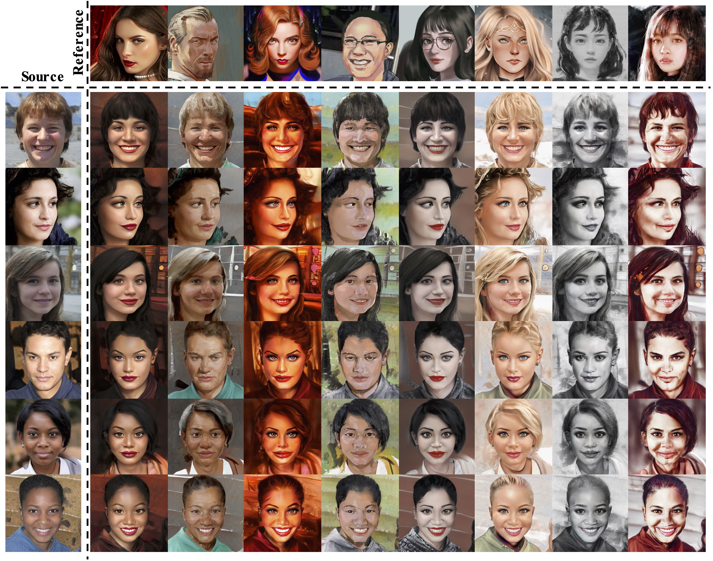

# BlendGAN: Implicitly GAN Blending for Arbitrary Stylized Face Generation <br><sub>Official PyTorch implementation of the NeurIPS 2021 paper (code will be released soon)</sub>



[Mingcong Liu](https://scholar.google.com/citations?user=IYx0IbgAAAAJ), [Qiang Li](https://scholar.google.com/citations?user=GGPvOP4AAAAJ), [Zekui Qin](https://github.com/ZekuiQin), [Guoxin Zhang](), [Pengfei Wan](), [Wen Zheng](https://sites.google.com/view/zhengwen-kwai)

Y-tech, Kuaishou Technology


### [Project page](https://onion-liu.github.io/BlendGAN) |   [Paper](https://arxiv.org/abs/2110.11728)

Abstract: *Generative Adversarial Networks (GANs) have made a dramatic leap in high-fidelity image synthesis and stylized face generation. Recently, a layer-swapping mechanism has been developed to improve the stylization performance. However, this method is incapable of fitting arbitrary styles in a single model and requires hundreds of style-consistent training images for each style. To address the above issues, we propose BlendGAN for arbitrary stylized face generation by leveraging a flexible blending strategy and a generic artistic dataset. Specifically, we first train a self-supervised style encoder on the generic artistic dataset to extract the representations of arbitrary styles. In addition, a weighted blending module (WBM) is proposed to blend face and style representations implicitly and control the arbitrary stylization effect. By doing so, BlendGAN can gracefully fit arbitrary styles in a unified model while avoiding case-by-case preparation of style-consistent training images. To this end, we also present a novel large-scale artistic face dataset AAHQ. Extensive experiments demonstrate that BlendGAN outperforms state-of-the-art methods in terms of visual quality and style diversity for both latent-guided and reference-guided stylized face synthesis.*


## Bibtex
If you use this code for your research, please cite our paper:
```
@inproceedings{liu2021blendgan,
    title = {BlendGAN: Implicitly GAN Blending for Arbitrary Stylized Face Generation},
    author = {Liu, Mingcong and Li, Qiang and Qin, Zekui and Zhang, Guoxin and Wan, Pengfei and Zheng, Wen},
    booktitle = {Advances in Neural Information Processing Systems},
    year = {2021}
}
```

## Acknowledgements

We sincerely thank all the reviewers for their comments. We also thank Zhenyu Guo for help in preparing the comparison to StarGANv2.
